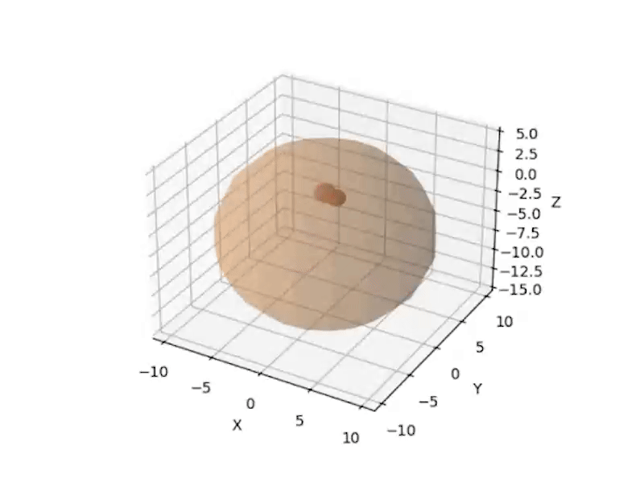

# Tumor-Growth-Simulation

This project is a simulation for the evolution of a tumor based on it's `genetic code` using `reinforcement learning`. Tumors are abnormal masses of cells that develop on an organ or a specific tissue, require a blood supply to grow (in anatomical terms: angionesis) and can have a variable grow.

For this simulation, the `TumorEnv` class is used to initialize the tumor, the environment and the behavior (I also implemented the possibility to run many other simulations in parallel in the `runParallelSimulation() -> Simulation.py`). Each generated tumor will have it's own randomized genetic code and based on the pattern it can influence: density, growth rate, asymetry, heterogeneity (diversity) and the tissue type (it can have only one type: red - muscular type, blue - castilage-like, orange - organ tissue). The behavior is: new cells are added only near the existing ones, `blood vessels` are generated every new 10 cells, the tumor grows on an organ, `reinforcement learning` is used to explore different growth strategies. An example of a tumor:

The organ will be generated just as a sphere:

Reinforcement Learning principles used: 
- the `RL agent` is the tumor
- the `RL environment` is defined in `TumorEnv`
- the available actions are: `normal growth` (balanced cell expansion), `rapid expansion` (aggressive tumor growth), `reduced growth` (cells multiply at a slower rate)
- `the reward` is proportional to the number of cells which motivates the tumor to grow.

The mathematical model is as follows:

1. Definitions and notation

The tumor is represented as a set of `spherical cells` of radius $r_i$ in a 3D space with the position $C_i = (x_i, y_i, z_i)$ and the whole structure at time step $t$ is a set $T(t) = \{ (C_1, r_1), (C_2, r_2),...,(C_n, r_n) \} $, where $n$ is the number of cells at time $t$.
The genetic traits: $density (d)$ influences how closely cells are packed, $growth rate (g)$ determines how fast new cells are added, $assymetry (a)$ controls random deviations in growth, $heterogeneity (h)$ determines variations in cell sizes.
RL components: $state S_t$ represents the tumor at time $t$ as $S_t = T(t)$, $action A_t$ from where the agent chooses an action: $A \in \{normal growth, rapid growth, slow growth \}$, reward $R_i$ based on the tumor size and transition function $S_{t+1} = f(S_t, A_t)$.

2. Tumor Growth Model

Each cell is placed near an existing cell in a random direction: $C_{new} = C_{parent} + d v$, with d, the distance factor based on the density and v a random vector unit. I chose the cell radius to follow a heterogenous distribution: $r_{new} = max(0.8, min(1.2, N(1.0, h)))$, with $N$ the random normal distribution and $h$ the heterogeneity factor controlling size variability.

3. Reinforcement Learning Model

The RL agent controls tumor growth by selecting actions at each step.
The state $S_t$ consists of: $S_t = C_1, C_2,..., C_n, r_1, r_2,..., r_n$ which encodes the positions and siez of tumor cells and number of blood vessels.
The agent can choose:
- Nomal growth (A = 0)
- Rapid growth (A = 1)
- Slow growth (A = 2)

The reward encourages growth but penalizes excessive expansion: $R_t = n - \lambda max(0, n-200)$, with n current tumor size and $\lambda$ penalty factor for exceeding size limit.

You can see a simulation below:

Bibliographical references:
- Byrne, H. M. (2010). Dissecting cancer through mathematics: from the cell to the animal model. Nature Reviews Cancer, 10(3), 221-230
- Araujo, R. P., & McElwain, D. L. (2004). A history of the study of solid tumour growth: The contribution of mathematical modelling. Bulletin of Mathematical Biology, 66(5), 1039-1091
- Folkman, J. (1971). Tumor angiogenesis: therapeutic implications. New England Journal of Medicine, 285(21), 1182-1186
- Hanahan, D., & Weinberg, R. A. (2011). Hallmarks of cancer: the next generation. Cell, 144(5), 646-674
- Sutton, R. S., & Barto, A. G. (2018). Reinforcement Learning: An Introduction (2nd Edition). MIT Press
- Silver, D., et al. (2017). Mastering the game of Go without human knowledge. Nature, 550(7676), 354-359
- Esteva, A., et al. (2017). Dermatologist-level classification of skin cancer with deep neural networks. Nature, 542(7639), 115-118
- Ciresan, D. C., et al. (2012). Deep neural networks segment neuronal membranes in electron microscopy images. Advances in Neural Information Processing Systems (NeurIPS), 2852-2860
- Tracqui, P. (2009). Biophysical models of tumour growth. Reports on Progress in Physics, 72(5), 056701
- Altrock, P. M., Liu, L. L., & Michor, F. (2015). The mathematics of cancer: integrating quantitative models. Nature Reviews Cancer, 15(12), 730-745
