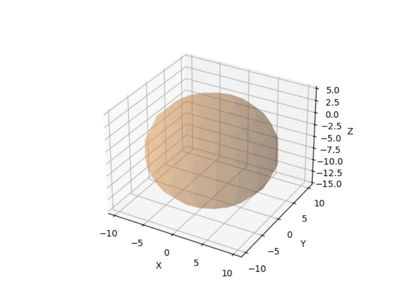

# Tumor-Growth-Simulation

This project is a simulation for the evolution of a tumor based on it's `genetic code` using `reinforcement learning`. Tumors are abnormal masses of cells that develop on an organ or a specific tissue, require a blood supply to grow (in anatomical terms: angionesis) and can have a variable grow.

For this simulation, the `TumorEnv` class is used to initialize the tumor, the environment and the behavior (I also implemented the possibility to run many other simulations in parallel in the `runParallelSimulation() -> Simulation.py`). Each generated tumor will have it's own randomized genetic code and based on the pattern it can influence: density, growth rate, asymetry, heterogeneity (diversity) and the tissue type (it can have only one type: red - muscular type, blue - castilage-like, orange - organ tissue). The behavior is: new cells are added only near the existing ones, `blood vessels` are generated every new 10 cells, the tumor grows on an organ, `reinforcement learning` is used to explore different growth strategies. An example of a tumor:

The organ will be generated just as a sphere:

Reinforcement Learning principles used: 
- the `RL agent` is the tumor
- the `RL environment` is defined in `TumorEnv`
- the available actions are: `normal growth` (balanced cell expansion), `rapid expansion` (aggressive tumor growth), `reduced growth` (cells multiply at a slower rate)
- `the reward` is proportional to the number of cells which motivates the tumor to grow.

The mathematical model is as follows:

The tumor is represented as a set of `spherical cells` of radius $r_i$ in a 3D space with the position $C_i = (x_i, y_i, z_i)$ and the whole structure at time step $t$ is a set 
 = \{(C_1, r_1), (C_2, r_2),...,(C_n, r_n)\})
, where $n$ is the number of cells at time $t$.
