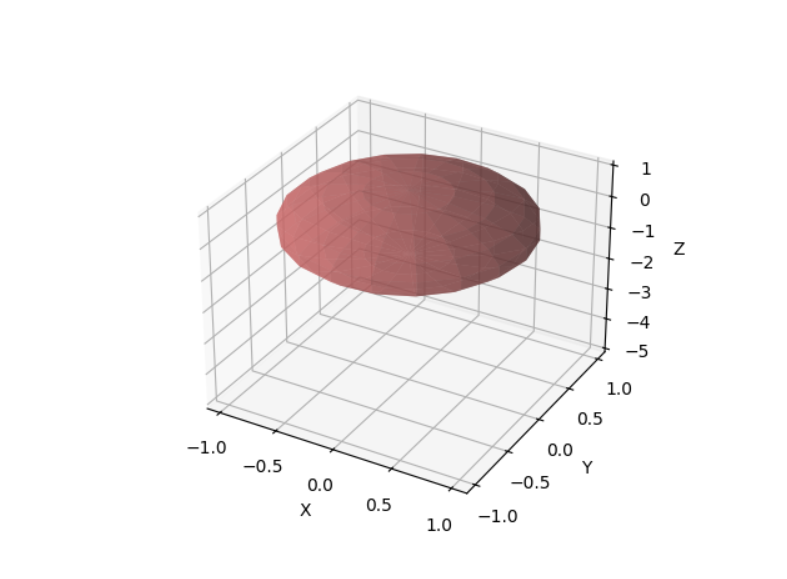

# Tumor-Growth-Simulation

This project is a simulation for the evolution of a tumor based on it's `genetic code` using `reinforcement learning`. Tumors are abnormal masses of cells that develop on an organ or a specific tissue, require a blood supply to grow (in anatomical terms: angionesis) and can have a variable grow.

For this simulation, the `TumorEnv` class is used to initialize the tumor, the environment and the behavior (I also implemented the possibility to run many other simulations in parallel in the `runParallelSimulation() -> Simulation.py`). Each generated tumor will have it's own randomized genetic code and based on the pattern it can influence: density, growth rate, asymetry, heterogeneity (diversity) and the tissue type (it can have only one type).

