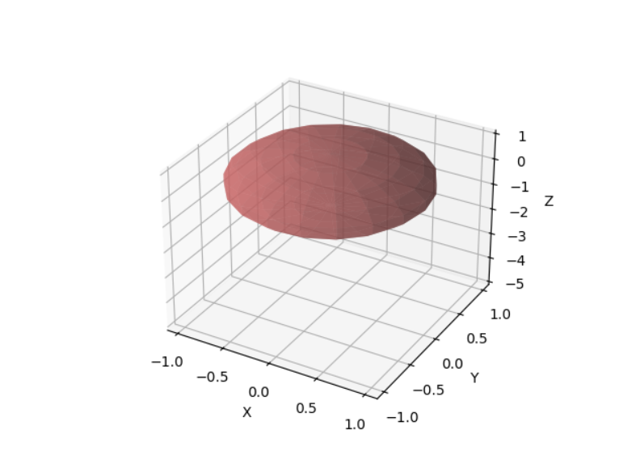
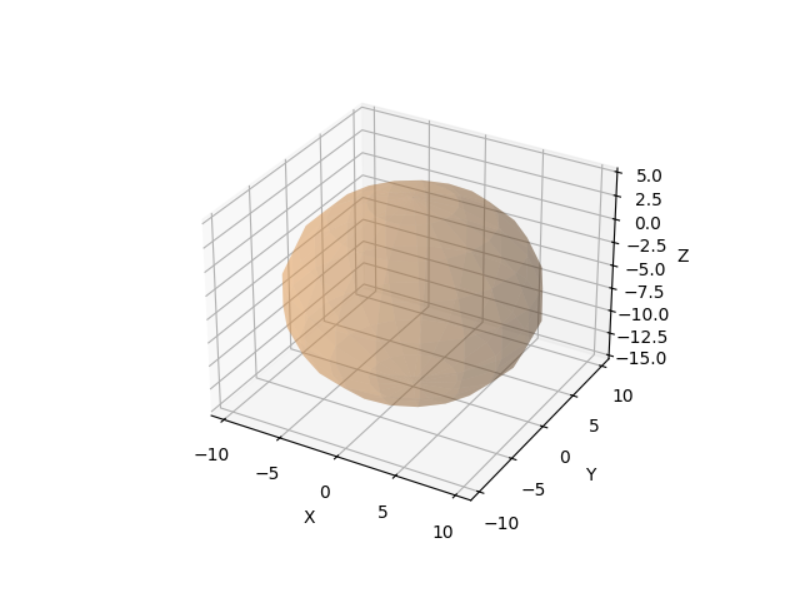
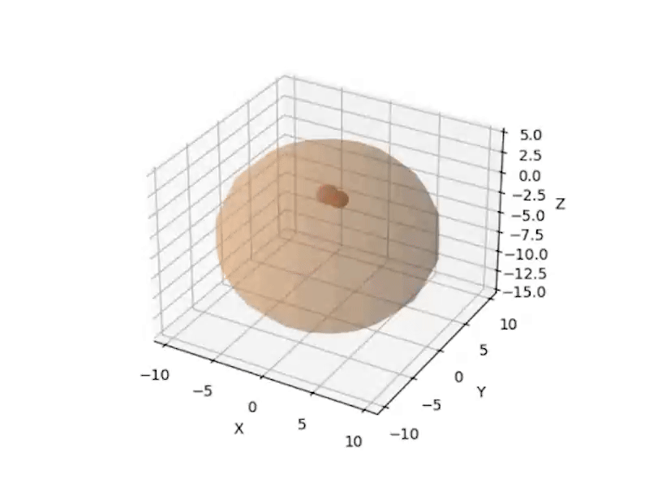

# Tumor Growth Simulation

This project presents a biologically-inspired simulation of tumor evolution based on a randomized genetic code and guided by reinforcement learning principles. Tumors, defined as abnormal and uncontrolled cell growths in tissues or organs, depend on angiogenesis (the formation of blood vessels) for continued development. This simulation aims to model tumor growth dynamics in a controlled virtual environment, capturing key biological features.

## Overview

The simulation utilizes the `TumorEnv` class to define the tumor's behavior and the environmental constraints. It supports running multiple simulations in parallel through the `runParallelSimulation()` function defined in `Simulation.py`. Each tumor instance is initialized with a unique genetic code influencing the following characteristics:

- **Density**: Spatial packing of cells
- **Growth rate**: Speed of cellular reproduction
- **Asymmetry**: Deviation from uniform spherical growth
- **Heterogeneity**: Variability in cell sizes
- **Tissue type**: One of the following
  - Red: Muscle-like tissue
  - Blue: Cartilage-like tissue
  - Orange: Organ tissue

### Key Behaviors Modeled:
- New cells can only form near existing ones
- A new blood vessel is generated for every 10 new cells
- The tumor grows over a spherical organ
- Reinforcement learning (RL) is used to dynamically explore and optimize growth strategies

### Example Visualizations

Tumor (sample growth phase):

Spherical organ structure:

## Reinforcement Learning Framework

The RL framework follows a standard agent-environment interaction model:

- **Agent**: The tumor
- **Environment**: The 3D tissue structure defined in `TumorEnv`
- **Actions**:
  - `Normal growth`: Balanced and stable expansion
  - `Rapid growth`: Aggressive expansion
  - `Reduced growth`: Slow and conservative cell reproduction
- **Reward Function**:
  - Encourages growth proportionally to the number of cells
  - Penalizes excessive growth beyond a threshold of 200 cells
  
  $$ R_t = n - \lambda \cdot \max(0, n - 200) $$

Where $n$ is the number of cells and $\lambda$ is the penalty factor.

## Mathematical Modeling

### 1. Notation and Definitions
- Tumor at time $t$:
  $$ T(t) = \{ (C_1, r_1), (C_2, r_2), ..., (C_n, r_n) \} $$
  Where $C_i = (x_i, y_i, z_i)$ is the 3D coordinate of the $i$-th cell, and $r_i$ its radius.

- Genetic traits:
  - $d$: Density (affects distance between cells)
  - $g$: Growth rate
  - $a$: Asymmetry factor
  - $h$: Heterogeneity factor (controls size variability)

### 2. Growth Algorithm
New cells are generated near a parent cell:
  $$ C_{new} = C_{parent} + d \cdot v $$
Where $v$ is a random unit vector and $d$ is derived from the density.

Cell radius is sampled as:
  $$ r_{new} = \max(0.8, \min(1.2, N(1.0, h))) $$
Where $N(1.0, h)$ is a normal distribution centered at 1.0 with standard deviation $h$.

### 3. RL State Definition
The state $S_t$ includes:
- Coordinates and radii of all tumor cells: $\{C_1, C_2, ..., C_n, r_1, r_2, ..., r_n\}$
- Number of blood vessels

### Action Set
- $A = \{0: \text{Normal}, 1: \text{Rapid}, 2: \text{Slow}\}$

### Transition Function
- $S_{t+1} = f(S_t, A_t)$ is determined by spatial constraints and genetic traits.

## Simulation Example

Below is a rendered GIF of tumor development over time:

## References

- Byrne, H. M. (2010). *Dissecting cancer through mathematics: from the cell to the animal model*. Nature Reviews Cancer, 10(3), 221-230.
- Araujo, R. P., & McElwain, D. L. (2004). *A history of the study of solid tumour growth: The contribution of mathematical modelling*. Bulletin of Mathematical Biology, 66(5), 1039-1091.
- Folkman, J. (1971). *Tumor angiogenesis: therapeutic implications*. New England Journal of Medicine, 285(21), 1182-1186.
- Hanahan, D., & Weinberg, R. A. (2011). *Hallmarks of cancer: the next generation*. Cell, 144(5), 646-674.
- Sutton, R. S., & Barto, A. G. (2018). *Reinforcement Learning: An Introduction* (2nd Edition). MIT Press.
- Silver, D., et al. (2017). *Mastering the game of Go without human knowledge*. Nature, 550(7676), 354-359.
- Esteva, A., et al. (2017). *Dermatologist-level classification of skin cancer with deep neural networks*. Nature, 542(7639), 115-118.
- Ciresan, D. C., et al. (2012). *Deep neural networks segment neuronal membranes in electron microscopy images*. NeurIPS, 2852-2860.
- Tracqui, P. (2009). *Biophysical models of tumour growth*. Reports on Progress in Physics, 72(5), 056701.
- Altrock, P. M., Liu, L. L., & Michor, F. (2015). *The mathematics of cancer: integrating quantitative models*. Nature Reviews Cancer, 15(12), 730-745.

---

This project is part of a student research initiative aimed at exploring computational oncology through artificial intelligence and mathematical modeling. Feedback and collaboration are welcome.

